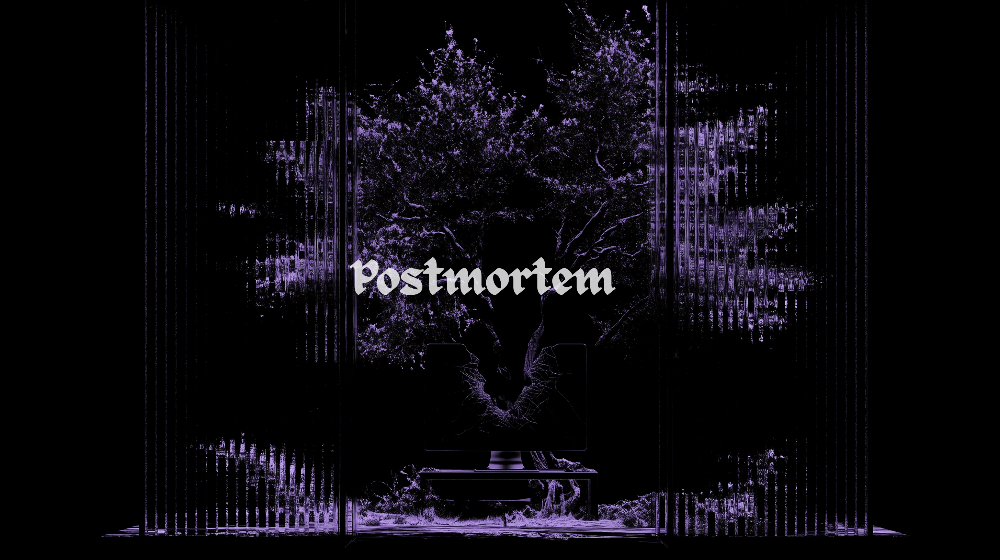

<p align="center">
  
</p>

<h1 align="center">postmortem</h1>

<p align="center">
  <b>Catch a supply-chain attack before it ships.</b><br>
  A fast supply-chain security scanner for the code you depend on.
</p>

<p align="center">
  Single static binary&nbsp;&middot;&nbsp;No telemetry&nbsp;&middot;&nbsp;No daemon&nbsp;&middot;&nbsp;Network only when you ask
</p>

---

Modern software is mostly other people's code. postmortem inspects that code the
way an attacker's payload actually reaches you: through install hooks, typosquats,
hijacked maintainer accounts, and freshly-transferred repos. It reads your
lockfiles across seven language ecosystems, reconstructs the full dependency
graph, and flags what real compromises look like.

## Why postmortem

* **Fits behind a corporate proxy.** A `network` block in `~/.postmortem/config.yml`
  sets the proxy, its `no_proxy` exemptions, and a base-URL override for every
  service — internal mirrors, GitHub Enterprise, a self-hosted GitLab. A typo in
  a key is an error, never a silent fallback to the public registry.
* **No telemetry.** postmortem never phones home. It reaches the network only on
  the paths that need it — `--online` reputation and `--vulns` / `system --vulns`
  advisory lookups — and even then only sends the package coordinates being
  queried.
* **Finds attacks, not just CVEs.** Malicious install scripts, obfuscated
  payloads, embedded IOCs (IPs, domains, wallets), typosquats across six
  ecosystems (npm, PyPI, crates.io, RubyGems, Packagist, Go — offline, each
  against its own corpus), and provenance
  anomalies (new publisher, dormant release, an install script that appeared out
  of nowhere).
* **Reputation intelligence.** Score every dependency on its real source repo
  (stars, age, activity, language) across GitHub, GitLab, and Codeberg.
* **Maintainer graph.** `tree --human` ranks the *accounts* that control your
  tree by what a compromise of each would reach — the unit that actually gets
  phished. On a real 466-package project: 3 accounts control 41% of it.
* **Audit your machine too.** `system` inspects your OS packages (Homebrew,
  Arch/pacman, Debian/Ubuntu apt, Fedora/RHEL dnf, Nix, and Alpine apk): unsigned
  or third-party sources, PPAs and AUR builds, unverified store paths,
  install-time hooks, setuid binaries and file diversions, weakened signing
  trust, and tampered files — plus `system --vulns` for known CVEs (OSV for
  apt/apk/dnf, the Arch Security Tracker for pacman).
* **Deep source inspection.** `system inspect <pkg> --deep` clones every
  dependency's real source and runs the full detection suite over it.
* **CI-ready.** Every command has a machine format — JSON throughout, SARIF for
  GitHub Code Scanning, and a self-contained HTML report from `scan` and `tree`.
  Plus a configurable gate — shared by `tree`, `audit` and `system` — that fails
  the build on risk. Thresholds are fail-closed: asking for a check the run could
  not perform exits 2 rather than passing.
* **Licenses, honestly.** A CycloneDX SBOM with a real `licenses` array, plus a
  `licenses` command and a deny/allow policy that fails the build. Read offline
  for Node and PHP; elsewhere from the same registry call reputation already
  makes. An identifier we can't verify is reported as free text, never emitted as
  an SPDX id a consumer would reject the whole document over.
* **Ships-only view.** `--omit dev` drops your test and build tooling from every
  count, score and CVE tally. Scope is computed by reachability, not by what a
  manifest happens to list — so a package your application also uses is never
  dropped, however deep the dev tree it also appears in.
* **Honest.** A flat or unparseable graph raises a diagnostic, so `0 findings` is
  never mistaken for "clean" — and an `--omit` that removed packages says so, in
  the terminal and in the JSON.

## Quick start

```bash
postmortem scan .                       # find malicious code in your dependencies
postmortem tree . --online              # score dependencies by repo reputation
postmortem tree . --online --vulns      # add known CVE / GHSA / OSV advisories
postmortem tree . --omit dev            # only what actually ships
postmortem tree . --online --human      # which humans control your tree
postmortem audit . --online --vulns     # one graded verdict: malware + risk + CVEs
postmortem licenses . --online          # license inventory + policy gate
postmortem fix .                        # the minimum upgrade that clears the CVEs
postmortem why left-pad .               # why is this package installed?
postmortem why left-pad . --blast       # if it were compromised, what breaks?
postmortem timeline event-stream        # when did this package change hands?
postmortem scripts .                    # what runs code when I install?
postmortem hook install                 # scan staged lockfile changes
postmortem diff <github-pr-url> --online # what does this PR pull in, and is it safe?
postmortem sbom . -o sbom.json          # export a CycloneDX 1.5 SBOM
postmortem tree . --online --html -o r.html   # a shareable HTML report
postmortem system                       # audit your installed OS packages
postmortem system --vulns               # + known CVEs for what's installed
postmortem system inspect wget --deep   # clone + audit one package's full source
```

## Install

**Homebrew**

```bash
brew tap mlab-sh/postmortem https://github.com/mlab-sh/postmortem.git
brew install postmortem
```

**Prebuilt binary** (macOS and Linux, arm64 and x86_64): grab a tarball from the
[releases page](https://github.com/mlab-sh/postmortem/releases).

**From source** (a recent Rust toolchain):

```bash
git clone https://github.com/mlab-sh/postmortem.git
cd postmortem && cargo build --release
```

## What's inside

| Command | What it does |
|---|---|
| [`scan`](https://github.com/mlab-sh/postmortem/wiki/Scan) | Static analysis of dependency code for malicious patterns, fully local. |
| [`tree`](https://github.com/mlab-sh/postmortem/wiki/Tree) | Dependency graph, plus online reputation, provenance, and known-vulnerability intelligence. |
| [`audit`](https://github.com/mlab-sh/postmortem/wiki/Audit) | One-shot graded health check: malware scan + inventory, plus optional reputation and vulns. |
| [`licenses`](https://github.com/mlab-sh/postmortem/wiki/Licenses) | License inventory across the graph, with a deny / allow / fail-on-unknown policy. |
| [`fix`](https://github.com/mlab-sh/postmortem/wiki/Fix) | Turn the vulnerability report into the change that clears it: minimum upgrade, direct command or override snippet. |
| [`why`](https://github.com/mlab-sh/postmortem/wiki/Why) | Explain why a package is installed — and with `--blast`, what a compromise of it would reach. |
| [`diff`](https://github.com/mlab-sh/postmortem/wiki/Diff) | Compare two project states — or a GitHub PR by URL — and assess what the change introduces. |
| [`sbom`](https://github.com/mlab-sh/postmortem/wiki/Sbom) | Export the resolved dependency graph as a CycloneDX 1.5 SBOM. |
| [`system`](https://github.com/mlab-sh/postmortem/wiki/System) | Audit your machine's OS package managers, and deep-inspect any package's real source. |
| [`scripts`](https://github.com/mlab-sh/postmortem/wiki/Install-Time) | Which dependencies execute code at install time, whether each is approved, and what its script does. |
| [`hook`](https://github.com/mlab-sh/postmortem/wiki/Install-Time) | Git pre-commit hook for staged dependency changes. |
| [`timeline`](https://github.com/mlab-sh/postmortem/wiki/Timeline) | Lay a package's release history out in order: handovers, install scripts, repository moves. |
| [`ci`](https://github.com/mlab-sh/postmortem/wiki/CI-Templates) | Print a ready-to-commit pipeline for GitLab CI, Azure DevOps, Jenkins or GitHub Actions. |
| [`allowlist`](https://github.com/mlab-sh/postmortem/wiki/Allowlist) | Every suppression the project declares, with how long each has left to run. |
| [`cache`](https://github.com/mlab-sh/postmortem/wiki/Cache) | Manage the local cache used by the online paths. |

**Ecosystems:** Node (npm / pnpm / yarn), Python, Rust, Ruby, PHP, Go, and
Java / Kotlin. Source-code scanning additionally covers C, C++, and Perl.

See [CHANGELOG.md](CHANGELOG.md) for what changed in each release.

## Documentation

The full manual lives in the
**[wiki](https://github.com/mlab-sh/postmortem/wiki)**:

* [Commands](https://github.com/mlab-sh/postmortem/wiki/Home): scan, tree, system, cache
* [Ecosystems and hosts](https://github.com/mlab-sh/postmortem/wiki/Ecosystems-and-Hosts)
* [Online resolution and scoring](https://github.com/mlab-sh/postmortem/wiki/Online-Resolution)
* [Licenses](https://github.com/mlab-sh/postmortem/wiki/Licenses) and [dependency scopes](https://github.com/mlab-sh/postmortem/wiki/Dependency-Scopes)
* [Source-code scanning](https://github.com/mlab-sh/postmortem/wiki/Source-Code-Scanning)
* [CI gate](https://github.com/mlab-sh/postmortem/wiki/CI-Gate), [CI templates](https://github.com/mlab-sh/postmortem/wiki/CI-Templates) and [Configuration](https://github.com/mlab-sh/postmortem/wiki/Configuration)

## License

See [LICENSE](LICENSE).

<p align="center"><i>
Don't dig up the corpse to find the cause of death after the breach.<br>
Do it before you ship the dependency.
</i></p>
